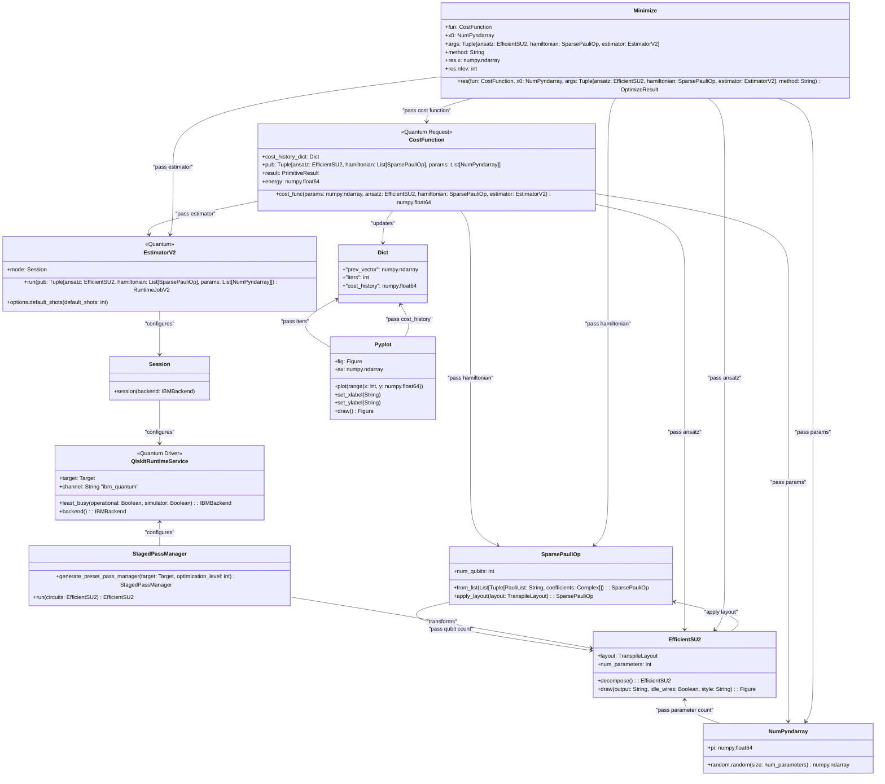

```mermaid
classDiagram
    class SparsePauliOp {
        +num_qubits: int
        +from_list(List[Tuple[PauliList: String, coefficients: Complex]]): SparsePauliOp
        +apply_layout(layout: TranspileLayout): SparsePauliOp
    }

    class EfficientSU2 {
        +layout: TranspileLayout
        +num_parameters: int
        +decompose(): EfficientSU2
        +draw(output: String, idle_wires: Boolean, style: String): Figure
    }

    class QiskitRuntimeService{
        <<Quantum Driver>>
        +target: Target
        +channel: String "ibm_quantum"
        +least_busy(operational: Boolean, simulator: Boolean): IBMBackend
        +backend(): IBMBackend
    }
    
    class StagedPassManager {
        +generate_preset_pass_manager(target: Target, optimization_level: int) StagedPassManager
        +run(circuits: EfficientSU2) EfficientSU2
    }
    
    class NumPyndarray {
        +pi: numpy.float64
        +random.random(size: num_parameters) numpy.ndarray
    }
    
    class Minimize {
        +fun: CostFunction
        +x0: NumPyndarray
        +args: Tuple[ansatz: EfficientSU2, hamiltonian: SparsePauliOp, estimator: EstimatorV2]
        +method: String
        +res.x: numpy.ndarray
        +res.nfev: int
        +res(fun: CostFunction, x0: NumPyndarray, args: Tuple[ansatz: EfficientSU2, hamiltonian: SparsePauliOp, estimator: EstimatorV2], method: String) OptimizeResult
    }
    
    class Session {
        +session(backend: IBMBackend)
    }
    
    class EstimatorV2 {
        <<Quantum>>
        +mode: Session
        +run(pub: Tuple[ansatz: EfficientSU2, hamiltonian: List[SparsePauliOp], params: List[NumPyndarray]]) RuntimeJobV2
        +options.default_shots(default_shots: int)
    }
    
    class CostFunction{
        <<Quantum Request>>
        +cost_history_dict: Dict
        +pub: Tuple[ansatz: EfficientSU2, hamiltonian: List[SparsePauliOp], params: List[NumPyndarray]]
        +result: PrimitiveResult
        +energy: numpy.float64
        +cost_func(params: numpy.ndarray, ansatz: EfficientSU2, hamiltonian: SparsePauliOp, estimator: EstimatorV2) numpy.float64
    }
    
    class Dict {
        +"prev_vector": numpy.ndarray
        +"iters": int
        +"cost_history": numpy.float64
    }
    
    class Pyplot {
        +fig: Figure
        +ax: numpy.ndarray
        +plot(range(x: int, y: numpy.float64))
        +set_xlabel(String)
        +set_ylabel(String)
        +draw() Figure
    }
    
    SparsePauliOp --> EfficientSU2 : "pass qubit count"
    QiskitRuntimeService <-- StagedPassManager : "configures"
    StagedPassManager --> EfficientSU2 : "transforms"
    EfficientSU2 --> SparsePauliOp : "apply layout"
    EfficientSU2 <-- NumPyndarray : "pass parameter count"
    CostFunction --> EfficientSU2 : "pass ansatz"
    CostFunction --> NumPyndarray : "pass params"
    CostFunction --> SparsePauliOp : "pass hamiltonian"
    CostFunction --> EstimatorV2 : "pass estimator"
    CostFunction --> Dict : "updates"
    Session --> QiskitRuntimeService : "configures"
    EstimatorV2 --> Session : "configures"
    Minimize --> CostFunction : "pass cost function"
    Minimize --> NumPyndarray : "pass params"
    Minimize --> EfficientSU2 : "pass ansatz"
    Minimize --> SparsePauliOp : "pass hamiltonian"
    Minimize --> EstimatorV2 : "pass estimator"
    Dict <-- Pyplot : "pass iters"
    Dict <-- Pyplot : "pass cost_history"

    
```
