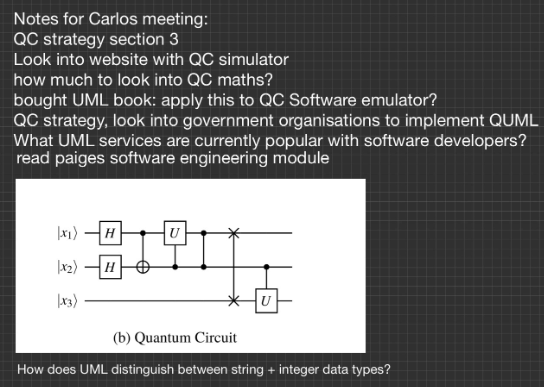

# Meeting Notes
### Extracted from the logbook which will be submitted with the dissertation
## 17/01/2024

Met with Carlos and was given additional reading: [A Quantum Software Modeling Language](https://link.springer.com/chapter/10.1007/978-3-031-05324-5_6). 
I understood that the project would be related to how quantum computers can be represented 
in UML. I believe UML is an achievable language to learn and base my main project on, 
and I would have the opportunity to better understand quantum computers.

## 14/02/2024

First group meeting with Carlos and other students working on quantum-related projects. 
Carlos mentioned his new paper Q-Cosmic, which I’ll read after the meeting to discuss 
afterwards and give a broader understanding of quantum software engineering—we discussed 
what background knowledge we’d need for our projects, the first step, how to achieve it, 
and which technologies. The project proposal is due roughly 1st March and will be a concrete 
dissertation topic. 

## 21/02/2024

Second group meeting. To look into Grover and Shor algorithms, understanding 
quantum algorithms will aid in fully comprehending the UML examples provided in the QUML 
paper and creating other UML diagrams. We discussed Q-Cosmic; it's the beginning of thinking 
about how to quantify the size of the software before its existence to charge it in the future. 
Q-Cosmic: Hybrid Communication. Carlos suggested that to investigate communication diagrams further, 
look into Quantum State Preparation when moving from classical to Quantum and Quantum Measurement 
when moving from Quantum to classical.

## 13/03/2024

Third group meeting. I discussed my concerns with Carlos, who advised me to avoid 
getting bogged down in the details. I don’t need to understand the fundamentals of 
linear algebra and everything involved with quantum to complete the project; this 
would be impossible anyway. I left the meeting with some “breathing space” to collect 
myself and work out the best first steps.

We discussed the properties of a good research paper when writing our own. The 
requirements are:
- abstract
- intro
- conclusion
- good title

It needs to leave the reader wanting more, each sentence adding further value, 
and avoid overselling what's written (good abstract, bad content). 
Original content should be 60%/70% with background information being 40%/30%.

I’ve opted to base the critical review on Carlos’ QUML paper as this is the basis 
for my project. We discussed what makes a good critical review:

- walk away understanding the reviewed paper
- understand what the results of the reviewed paper are about
- The reader doesn't need to read the reviewed paper; they can go off yours, and 
yours should be “better.”
- provide additional contributions to the reviewed paper
- contribute something meaningful
- something no one has done before; useful, novel and with value
- results, strengths and weaknesses

Carlos mentioned that literature reviews are valid scientific output. 
They typically condense 100 papers into 1, so you don't have to read 100! He also advised 
us to spend half of our time on the main project and the other half on the modules due to 
their significance to our final marks.

I’ve also made a note to look into Quantum Polarising Filters.

Reading recommendations:

- Systemisation of Knowledge (SoK) papers
- The New Scientist
- Quantum Computing for Computer Scientists by Mirco A. Mannucci and Noson S. Yanofsky
- Quantum Computation and Quantum Information by [Michael A. Nielsen](https://www.amazon.co.uk/Michael-A-Nielsen/e/B0058XJGHM/ref=dp_byline_cont_book_1) and [Isaac L. Chuang](https://www.amazon.co.uk/Isaac-L-Chuang/e/B005WHOMH8/ref=dp_byline_cont_book_2)

## 03/04/2024

Group meeting. We discussed the benefits of using Overleaf for the critical review
and dissertation due to its professional formatting and ability to utilise and create
a bibliography of Bibtex files for referencing. I need to confirm whether the
dissertation and corpus are one unified document or separate. It would be helpful
to obtain books on scientific writing/academic writing to understand better how to
write a good dissertation. Carlos has recommended keeping it clear and concise as a
general rule.

Carlos advised me to use an assertive voice instead of a passive voice. I should not
use the royal “we” or “I” but include the reader. For example, “We will study…” So we
as in myself and the reader, not the royal we.

Regarding critical review references, it would be helpful to compare other papers
related to the subject matter during the evaluation that may have achieved what the
reviewed paper didn’t. However, this is not essential.

## 05/04/2024

I spoke with Carlos during the final lecture after having a “lightbulb” moment regarding
UML communication diagrams and quantum. I asked whether a good question to ask is how UML
communication diagrams can be used to illustrate the communication between classical and
quantum computers, seeing as classical computers are needed to interact with quantum
computers at present. Carlos advised that it was a worthwhile question to ask.

## 28/05/2024

I emailed Carlos to ask how he made the diagrams  for his paper. However, this 
shouldn’t hinder me from analysing the diagrams in the paper. I’ve completed the use 
case diagram and will now move on to the class diagram.

## 11/06/2024

I received a reply from Carlos regarding what he used in the Q-UML paper: Lucidchart.

## 17/06/2024

I spoke with Carlos on Teams to discuss where I am now and the best steps going forward. 
Carlos thinks it is interesting to apply the two UML approaches, his and Perez-Castillo’s, 
and this is worth exploring. This could be used for both NISQ and standard QC systems. 
As I have spent time learning about QAOA and VQE, this would be a good place to start.

So, I will apply the two UML approaches to VQE rather than focusing on communication diagrams. 
I will start with a class diagram and break down how the algorithm operates; the next best step 
will be to code the algorithm in Qiskit following the IBM tutorial. Once I’ve had a go at working 
with it practically, I will start creating UML diagrams. 

Carlos advised that this would allow me to examine the strengths and weaknesses of the two UML 
approaches. I could also investigate other aspects beyond VQE, such as superposition and 
entanglement, as discussed in the paper, Grover’s algorithm, and how the UML approaches 
handle both NISQ and complete QC systems. However, having one complete piece of work is 
better than many half-baked pieces, so I will just focus on VQE for now. I sent Carlos a 
link to the UML profile and VQE paper.

## 09/10/2024

Resumed face-to-face meetings with Carlos and his peers. This was very helpful; I spoke with Chris and Lee, establishing a core question: what is an Eigensolver? We talked to Carlos, who advised that it would be a way of finding all the eigenvalues (energy states) in a Hamiltonian.

I spoke with Jorge about when to determine if a Qiskit object is classical or quantum. He confirmed that my assumption was correct and that there would be some sort of translation process from the quantum object to a classical one for it to receive the classical information. Jorge also explained how increasing a circuit by the number of qubits increases the complexity in polynomial time, whereas increasing the Hamiltonian by adding more terms increases the complexity exponentially.

Carlos also reassured me that focusing on VQE and the two SD adaptations would be enough for the project. I mentioned that one of the objectives of the early deliverable was to create multiple diagrams and model fundamental quantum concepts. There won’t be enough time to do that effectively. It means there should be much to discuss for future work and when reflecting on the project.

Qiskit club meeting notes:

Questions:
- Qiskit documentation confirming when the quantum hardware is accessed
- UML for quantum hardware and fundamental quantum properties
- What is an eigensolver? (finding the eigenvalues of a system) eigensolver can be quantum 
and classical
- Matlab
- Lanczos algorithm
- Quantum alternative to factoring, easy to verify, difficult to know, bqb complete
Sparse matrix - shallow circuit - depth (qubit count) breadth (circuit chain, has lack of coherency)

## 16/10/2024

Qiskit Club 2nd Meeting Notes:

- Rendevous Games - find each other in a search space without communicating
- Artemis Moon Landing
- What is a wave function? A wave function describes a particle's quantum state, providing information about the probability of finding the particle in a particular position or state when measured.
- What is Born's rule? Born's rule states that the probability of finding a particle is the square of the wave function’s absolute value.
- What is Bayes rule? Bayes' rule calculates the probability of an event based on prior knowledge of conditions related to the event. It updates the probability as more evidence becomes available.

The topic discussed was Random Number Generation using QC.

*   Evolutionary algorithms (work done by Jorge). Fitness function = variation of the randomness

*   Fundamental entropy (ignorance) - non-randomness

*   Qubit to represent a bit, 8 bits for 256 number values (0 to 255)

*   Hadimard gates and CNOTS to randomise

*   Evolutionary algorithm to find the sequence of gates to pass randomness test (RNG test, ball/bull test?)

*   Different tests for different randomness

*   How do we prove randomness? Is this even possible?

*   Examples of binary sequences given with no information on how they were produced:

    *   101101011

    *   111111111

    *   Which one is more random? If we keep getting 1’s in our 1111 sequence, the probability of it not being random increases and the probability of getting 0 increases exponentially (probability of 1 * probability of 1 *, etc.)

*   RNG would have health tests that would not allow sequences such as 1111 or 0000

*   Kolmogorov complexity - shortest program complexity to output a sequence

    *   Complexity/Randomness/irreducible

    *   Programmes to write the sequence examples

        *   111111111 (print 1, repeat) less complex

        *   101101011(write a strong, print 1, print 0, print 1 etc.) more complex

## 23/10/2024

Qiskit Club. Watched a talk from Joseph about his defence, discussing blockchains and quantum advantage.
Notes:
- Hash function, shah 256
- Super conducting quantum device vs other devices
- Grover = quadratic advantage. Shor = exponential advantage.

## 06/11/2024

Today I refined the VQE and Qiskit section and have sent it to Carlos to get feedback. Attended Qiskit Club where I got really helpful information from my peers regarding how the hamiltonian is represented on the ansatz in order to find it's ground state in the algorithm, and also the significance of pi in relation to the parameter arrays given to the ansatz.

Qiskit Club notes:

- Attended talk on quantum super conductors
- Hamiltonian solving shroedinger equation
- Eigenvalue equation
- Opeator matrix multiplied by vector should be equal to eigenvalue multipled by the same vector
- Science/chemistry libre textbooks
- Explain PUB better at this communicated the mapping of Hamiltonian to ansatz
- Hamiltonian as a circuit, circuit as a vector, energy value of the vector, tweak parameters
- Photonics can be in room temperature
- 2 pi is a way to travel to every state in the bloc sphere

## 13/11/2024

Attended Qiskit club, I was able to discuss my disseration work with the group and Carlos which was productive. Discussed if there was a need for highlighting quantum technologies in UML if UML is general purpose anyway. Need to think of a better way to answer this, I believe it's still required, especially if quantum devices are to be used commerically in order to depict how much classical/quantum units are needed.

Notes from Carlos feedback from the VQE Qiskit and NISQ sections I sent him:

- QIskit VQE, too dry, why are we doing this? Add a bit in the beginning to give them a warning as to why they need to run through the VQE Qiskit algorithm
- Weave a story, explain what we're focusing on and why in each chapter section
- NISQ
- NP hard solve in P is not nessecarily true. General consesus is there is an overlap, problems known as BQP
- NP hard - if and only if can reduce every problem in np to be solved with the solution of this problem
- Reduction - solve littlest number by problem with sorting solution
- Problems that can be solved in P not NP hard as NP hard can solve all NP. Quantum can solve some NP, not all
- Carlos solution; speed up certain problems such as factoring
- Focus on what you do understaand well

## 15/11/2024

Tidied up files to submit everything that is not the disseration for the corpus, deadline is tomorrow. 
Checked with Carlos regarding the corpus who advised not to worry too much as the project is 
theoretical work:

*"The corpus is essential in an engineering project, where you’re building something (say a java app).
Here it is more about the theoretical results. I really want to hear your conclusions about the 
pros/cons of both quantum UML approaches."*
